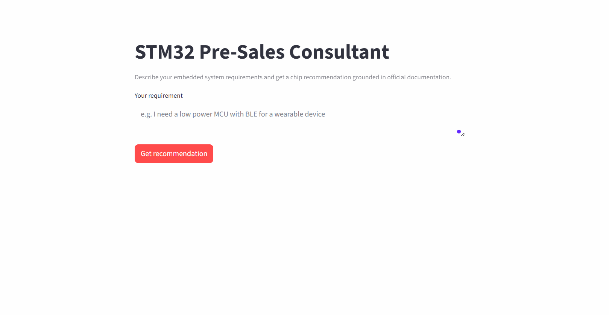
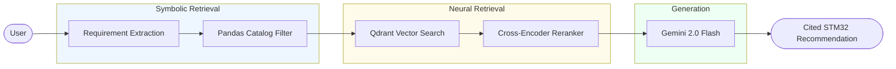

# STM32 Pre-Sales Consultant | Domain-Specific RAG System

An end-to-end domain-specific RAG system that takes natural language embedded system requirements and returns grounded, cited chip recommendations, combining deterministic symbolic filtering with neural retrieval.

> **"The LLM is not the main model. The system design is."**



---

## At a Glance

| Metric | Value |
|---|---|
| Documents ingested | 4 STM32 family datasheets |
| Pages processed | 865 |
| Indexed chunks | 2,856 |
| Avg chunk size | 503 characters |
| Chip recommendation accuracy | 87% (7/8 queries) |
| Avg retrieval latency | ~0.3s |
| Avg end-to-end latency | ~3–5s |

---

## Motivation

Many introductory RAG examples focus on generic document collections. This project explores a domain-specific engineering use case where retrieval precision is critical, recommending STM32 microcontrollers based on official ST Microelectronics datasheets.

The system simulates a real pre-sales engineering workflow: a user describes what they need in natural language, and the system reasons over technical documentation to return a specific chip recommendation with justification and citations.

---

## 🏗️ Hybrid RAG Pipeline


---

## Example Pipeline Trace

```
Query:   "I need a low power MCU with BLE for a wearable"

Step 1 — Requirement extraction:
  { "connectivity": ["BLE"], "use_case": "wireless-ble" }

Step 2 — Catalog filter:
  → STM32WB55RG matched (BLE 5.4, dual-core, 0.6µA stop current)

Step 3 — Retrieval (scoped to stm32wb55rg.pdf only):
  [1] p.1  — "BLE 5.4 compliant radio, stop current 0.6µA..."
  [2] p.12 — "Dual-core Cortex-M4 + Cortex-M0+ architecture..."
  [3] p.21 — "Ultra-low-power Stop2 and Standby modes..."

Step 4 — Generated answer:
  "The STM32WB55RG is recommended. It integrates BLE 5.4 and
   802.15.4 on a dual-core architecture (Cortex-M4 @ 64MHz +
   Cortex-M0+), with a stop current of 0.6µA [1]. Recommended
   dev board: NUCLEO-WB55RG [2]."
```

---

## Evaluation

Evaluated against a manually curated set of 8 representative engineering queries:

```
#    Query                                         Expected       Pass
---------------------------------------------------------------------
1    Low power MCU with BLE for a wearable         STM32WB55RG    ✓
2    Ultra low power for coin battery sensor        STM32L073RZ    ✓
3    High performance with Ethernet, 1MB flash      STM32H743ZI    ✓
4    Cheap general purpose chip for hobby project   STM32F411CE    ✓
5    MCU with BLE 5 and 802.15.4 support            STM32WB55RG    ✓
6    At least 1MB flash and 480MHz clock            STM32H743ZI    ✓
7    Stop mode current under 1 microamp             STM32L073RZ    ✓
8    USB and SPI for a mid range project            STM32F411CE    ✗

Result: 7/8 (87%)
```

Current evaluation uses exact-match chip identification. Planned improvements: Retrieval Recall@k, RAGAS faithfulness metrics, and a larger benchmark set.

---

## Engineering Challenges

**Challenge: Naive vector retrieval is noisy on technical datasheets**
STM32 datasheets repeat similar tables and spec blocks across sections. A raw similarity search returns many loosely-related chunks, confusing the LLM.
**Solution**: restricted retrieval to candidate chip datasheets before performing semantic search, the catalog filter acts as a hard scope on the vector search space.

**Challenge: Embedding similarity alone ranked generic sections above exact specs**
Bi-encoders compare query and chunk independently. A query about "BLE stop current" would retrieve sections mentioning BLE generally rather than the specific power consumption table.
**Solution**: added a cross-encoder reranker that sees query + chunk together, significantly improving precision on spec-heavy content.

**Challenge: Requirement extraction should not always require an LLM**
Calling Gemini for every query adds latency and burns API quota on simple cases like "I need BLE."
**Solution**: implemented keyword-first extraction BLE, Ethernet, low-power triggers are matched locally. Gemini is called only when keywords are insufficient.

**Challenge: PDF datasheets contain tables that lose structure on extraction**
PyMuPDF extracts table content as flat text, dropping column relationships.
**Solution**: accepted this as a conscious tradeoff for a first version. The LLM can reason over flat spec values. Structured table extraction is listed as a future improvement.

---

## Tech Stack

| Layer | Technology |
|---|---|
| Document parsing | PyMuPDF |
| Chunking | LangChain RecursiveCharacterTextSplitter |
| Embeddings | sentence-transformers (all-MiniLM-L6-v2) |
| Vector database | Qdrant |
| Structured filtering | Pandas + JSON catalog |
| Reranker | cross-encoder/ms-marco-MiniLM-L-6-v2 |
| LLM | Gemini 2.0 Flash |
| Backend | FastAPI |
| Frontend | Streamlit |
| Infrastructure | Docker Compose |

---

## How to Run

**Prerequisites**: Docker Desktop, Gemini API key ([aistudio.google.com](https://aistudio.google.com)), STM32 datasheets from [st.com](https://st.com)

```bash
git clone https://github.com/your-username/stm32-rag-assistant.git
cd stm32-rag-assistant
```

Add datasheets to `data/datasheets/` with these exact filenames:
`stm32wb55rg.pdf` · `stm32l073v8.pdf` · `stm32f411ce.pdf` · `stm32h753vi.pdf`

Set your key in `docker-compose.yml`:
```yaml
- GEMINI_API_KEY=your_key_here
```

```bash
docker compose up -d
docker compose exec backend python -m ingestion.run_ingestion
```

- UI: **http://localhost:8501**
- API docs: **http://localhost:8000/docs**

---

<details>
<summary><strong>Implementation Details</strong></summary>

### Design Decisions

**Chunking strategy for datasheets**
Chunk size of 600 characters with 80-character overlap, large enough to preserve spec context, small enough to stay precise. Separator priority: `\n\n` → `\n` → `. ` → ` ` respects ST's document structure.

**Temperature 0.1 for generation**
Pre-sales recommendations must be consistent and factual. Low temperature prevents creative but incorrect spec values.

### Knowledge Base

| Document | Family | Pages | Use Case |
|---|---|---|---|
| stm32wb55rg.pdf | STM32WB55 | 194 | BLE 5.4 + 802.15.4, dual-core wireless |
| stm32l073v8.pdf | STM32L073 | 163 | Ultra-low-power, 0.29µA stop current |
| stm32f411ce.pdf | STM32F411 | 151 | General purpose, 100MHz Cortex-M4 |
| stm32h753vi.pdf | STM32H7 | 357 | High performance, 480MHz, Ethernet |

